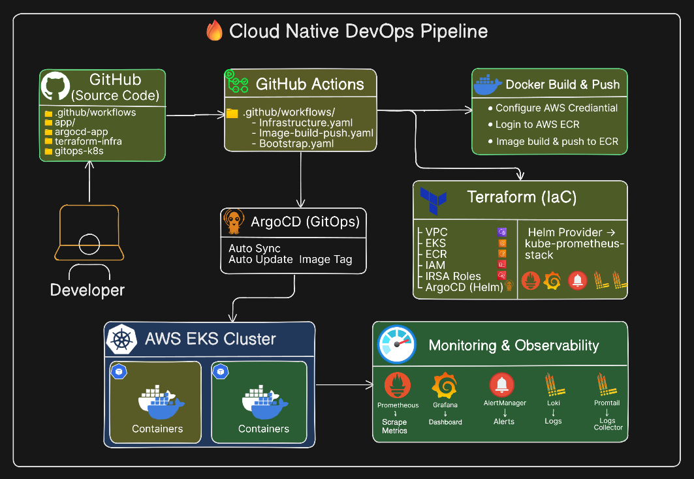
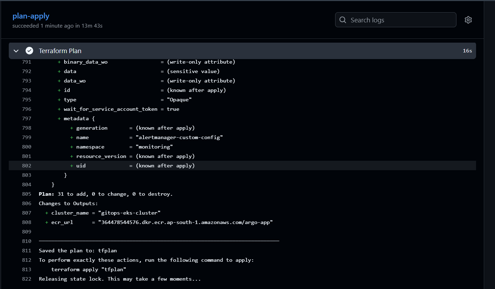
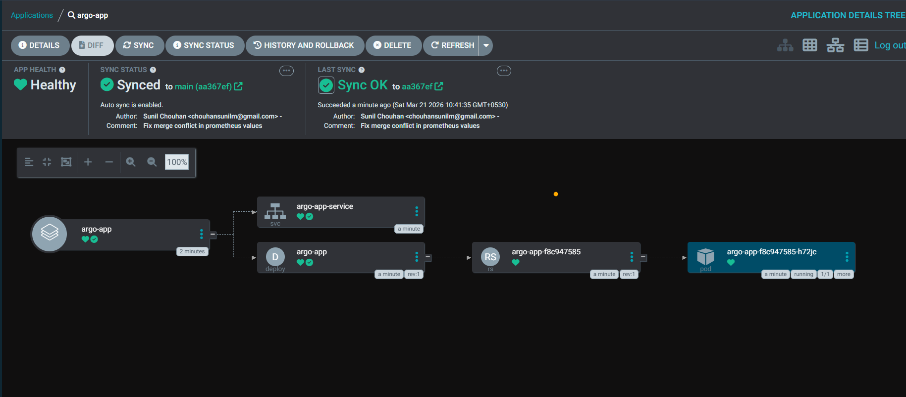
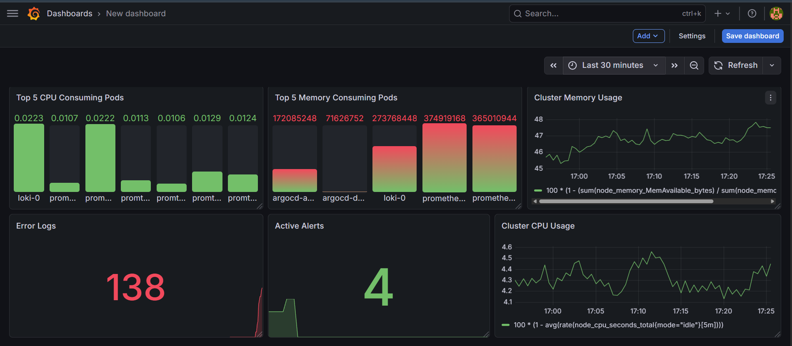

# Cloud Native DevOps Pipeline on AWS EKS

An end-to-end **Cloud Native DevOps Pipeline** built on **AWS EKS** that combines **CI/CD**, **Infrastructure as Code**, **GitOps**, **monitoring**, **logging**, and **alerting** into one integrated workflow.

This project demonstrates how modern DevOps practices can be used together to automate application delivery, manage Kubernetes infrastructure, observe workloads in real time, and notify engineers when incidents occur.

---

## Project Overview

The main goal of this project is to build a production-style DevOps pipeline where code changes move through a complete automated workflow:

- source code is stored in GitHub
- CI/CD is handled by GitHub Actions
- Docker images are built and pushed to Amazon ECR
- infrastructure is provisioned using Terraform
- the application is deployed on Amazon EKS
- ArgoCD manages GitOps-based synchronization
- Prometheus, Grafana, Loki, and Promtail provide observability
- Alertmanager sends notifications to Slack

Instead of treating CI/CD, GitOps, and observability as separate topics, this project brings them together into one working cloud-native system.

---

## Problem Statement

In many beginner projects, tools are used independently:

- CI/CD runs, but deployments are manual
- Kubernetes workloads run, but there is no monitoring
- metrics exist, but alerts do not reach engineers
- logs are collected, but troubleshooting is still difficult

This project solves that by creating a unified workflow where:

- application delivery is automated
- infrastructure is reproducible
- deployments are Git-driven
- metrics and logs are visible through dashboards
- alerts are routed to Slack in real time

---

## Solution Architecture

This project follows the architecture below:

**GitHub → GitHub Actions → Amazon ECR → Terraform → Amazon EKS → ArgoCD → Prometheus / Grafana / Loki / Promtail → Alertmanager → Slack**


### High-level flow

1. A developer pushes code to GitHub.
2. GitHub Actions runs CI/CD workflows.
3. The application image is built using Docker.
4. The image is pushed to Amazon ECR.
5. Terraform provisions or updates cloud and Kubernetes-related infrastructure.
6. ArgoCD syncs Kubernetes manifests from Git and deploys the application into EKS.
7. Prometheus collects metrics and evaluates alert rules.
8. Loki and Promtail collect and expose logs.
9. Alertmanager routes alerts to Slack.
10. Grafana visualizes system health using dashboards for metrics, logs, and alerts.

---

## Architecture Diagram




## Tech Stack

### Cloud
- AWS
- Amazon EKS
- Amazon ECR
- IAM / IRSA
- VPC and networking components

### CI/CD and GitOps
- GitHub
- GitHub Actions
- ArgoCD

### Containers and Orchestration
- Docker
- Kubernetes
- Amazon EKS

### Infrastructure as Code
- Terraform
- Helm provider / Helm-based deployments

### Observability
- Prometheus for metrics and alert evaluation
- Grafana for dashboards and visualization
- Loki for centralized logging
- Promtail for log collection
- Alertmanager for alert routing and grouping
- Slack for real-time notifications

### Application
- Python
- Dockerized application container

---

## Project Objectives

The objectives of this project were:

- build a cloud-native DevOps pipeline on AWS
- automate build and image push with GitHub Actions
- provision infrastructure using Terraform
- deploy applications to EKS using GitOps principles
- implement observability using metrics, dashboards, logs, and alerts
- integrate Slack for real-time alert delivery
- validate the full workflow from code change to operational visibility

---

## Key Features

- Automated CI/CD pipeline using GitHub Actions
- Docker image build and push to Amazon ECR
- Terraform-based infrastructure provisioning
- GitOps-based application deployment using ArgoCD
- Kubernetes-based application deployment on Amazon EKS
- Prometheus monitoring with custom alert rules
- Grafana dashboards for metrics and cluster visibility
- Centralized logging using Loki and Promtail
- Alert routing to Slack through Alertmanager
- End-to-end validation of deployment, monitoring, logging, and notification flow

---

## End-to-End Workflow

### 1. Source Code Management
The application source code, Kubernetes manifests, Terraform configurations, and GitHub workflow files are stored in GitHub.

### 2. Continuous Integration with GitHub Actions
GitHub Actions is used to automate key steps of the pipeline, such as:
- building the Docker image
- authenticating with AWS
- pushing the image to Amazon ECR
- triggering infrastructure-related workflows
- bootstrapping application and monitoring setup where required

### 3. Containerization and Registry
The application is containerized using Docker and stored in Amazon ECR, which acts as the image registry for deployments.

### 4. Infrastructure Provisioning with Terraform
Terraform is used to provision and manage infrastructure components required for the platform, such as:
- VPC and networking
- EKS cluster
- node groups
- ECR
- IAM roles
- namespaces
- ArgoCD-related components
- monitoring stack components deployed through Terraform/Helm integration

### 5. GitOps Deployment with ArgoCD
ArgoCD continuously watches the Git repository and ensures that the desired Kubernetes manifests match the actual state of the EKS cluster.

This enables:
- declarative deployments
- automated synchronization
- visible application health and sync state
- Git as the single source of truth

### 6. Monitoring with Prometheus
Prometheus is used to collect metrics from the Kubernetes environment and evaluate alert rules.

It helps monitor:
- cluster resource usage
- workload health
- custom application/system conditions
- alert rule state

### 7. Visualization with Grafana
Grafana dashboards are used to visualize:
- cluster CPU usage
- cluster memory usage
- top CPU-consuming pods
- top memory-consuming pods
- active alerts
- error logs and operational views

### 8. Logging with Loki and Promtail
Promtail collects logs from workloads and sends them to Loki, where they can be queried and visualized through Grafana.

This improves troubleshooting by combining:
- metrics
- logs
- dashboards
- alerts

### 9. Alerting with Alertmanager and Slack
Prometheus sends firing alerts to Alertmanager. Alertmanager groups, routes, and forwards them to Slack.

This provides a real incident flow:

**Prometheus → Alertmanager → Slack**

---

## Repository Structure

```text
.
├── .github/workflows/        # GitHub Actions workflows
├── alerts/                   # Prometheus alert rule files
├── app/                      # Application source code and Dockerfile
├── argocd/                   # ArgoCD application manifests
├── docs/                     # Architecture diagrams and screenshots
├── gitops-repo/              # Kubernetes manifests synced by ArgoCD
├── terraform/                # Terraform files for infrastructure and monitoring
└── README.md

```

### Folder Details

#### `.github/workflows/`
Contains GitHub Actions workflows responsible for:

- image build and push
- infrastructure automation
- bootstrap and pipeline-related jobs


#### `alerts/`
Contains custom Prometheus alert rules such as:

- high CPU usage alert
- pod restart alert
- always-firing test alert


#### `app/`
Contains the application source code and Docker build files:

- app.py
- Dockerfile
- requirements.txt


#### `argocd/`
Contains ArgoCD application manifests for:

- application deployment
- monitoring-related GitOps configuration


#### `docs/`
Contains:

- architecture diagrams
- screenshots
- documentation assets


#### `gitops-repo/`
Contains Kubernetes manifests used by ArgoCD, such as:

- deployment
- service
- kustomization


#### `terraform/`
Contains infrastructure and platform provisioning files for:

- EKS
- ECR
- IAM
- VPC
- Prometheus
- Loki
- Promtail
- ArgoCD
- and related components


## Infrastructure Components

The Terraform configuration provisions and manages the main infrastructure required for the project:

- VPC for networking isolation
- EKS Cluster for Kubernetes orchestration
- Node Group for worker nodes
- Amazon ECR for image storage
- IAM / IRSA for secure service permissions
- Namespaces for workload segregation
- Monitoring stack components such as Prometheus, Loki, and Promtail
- ArgoCD-related setup for GitOps workflows

This ensures the infrastructure is reproducible, version-controlled, and easier to manage.


## CI/CD Workflow

The CI/CD layer is implemented using GitHub Actions.

### Main responsibilities
- authenticate with AWS
- build Docker image
- push image to Amazon ECR
- run infrastructure workflows
- support deployment automation

### Benefits
- repeatable automation
- reduced manual deployment steps
- easy integration with GitHub-based source changes
- better visibility into build and infrastructure execution


## GitOps Workflow

The GitOps layer is implemented using ArgoCD.

### Why GitOps?

GitOps ensures that:

- Git remains the source of truth
- deployments are declarative
- cluster drift can be detected and corrected
- application sync status is visible

### In this project

ArgoCD watches the Git repository and syncs the manifests into the EKS cluster. The application status can be observed as:

- Healthy
- Synced

This validates that the deployed state matches the desired state stored in Git.

## Observability Stack

The observability stack in this project includes metrics, dashboards, logs, and notifications.

### Prometheus
Used for:

- metrics collection
- alert rule evaluation
- monitoring workload and cluster state

### Grafana
Used for:

- dashboard visualization
- metrics exploration
- active alert panels
- log-based troubleshooting views


### Loki
Used for:

- centralized log storage
- querying application and cluster logs


### Promtail
Used for:

- collecting logs from Kubernetes workloads
- forwarding them to Loki


### Alertmanager
Used for:

- grouping alerts
- routing alerts
- sending notifications to Slack


### Slack
Used for:

- real-time alert delivery
- operational notification flow


## Alerting Flow

The alerting system was designed and tested end to end.

### Flow

**Prometheus → Alertmanager → Slack**


### What happens
- Prometheus evaluates alert rules.
- When a condition is met, the alert enters the firing state.
- Alertmanager receives the alert.
- Alertmanager groups and routes alerts based on configuration.
- Slack receives the final notification.


### Why this matters

This converts monitoring data into actionable incident notifications, which is a critical part of real-world DevOps and SRE workflows.


## Alerts Implemented

The project includes custom test and operational alerts such as:

- AlwaysFiring Alert
- High CPU Alert
- Pod Restart Alert


You can expand this further with:

- pod not ready alerts
- crash loop alerts
- memory pressure alerts
- node health alerts


## Dashboards and Monitoring Views

Grafana dashboards in this project include views such as:

- Top CPU-consuming pods
- Top memory-consuming pods
- Cluster CPU usage
- Cluster memory usage
- Active alerts panel
- Error logs panel

These dashboards help provide a quick operational summary of system health.


## Screenshots / Proof

### GitHub Actions



### ArgoCD


### Grafana Dashboard



## Setup and Deployment Steps
### 1. Clone the repository


```bash
git clone https://github.com/SUNILCHOUHA/cloud-netive-devops-pipeline.git
cd cloud-native-devops-pipeline
```


### 2. Configure AWS credentials

Set up AWS credentials locally or through GitHub Actions secrets.

### 3. Provision infrastructure

```bash
cd terraform
terraform init
terraform plan
terraform apply
```

### 4. Build and push application image

This can be triggered through GitHub Actions, or manually if needed.


### 5. Configure ArgoCD

Apply the ArgoCD application manifests and verify sync status.


### 6. Verify deployment

Check:
- Kubernetes resources
- ArgoCD app health
- Prometheus targets and alerts
- Grafana dashboards
- Loki logs
- Slack notifications


## Challenges Faced

This project involved several practical debugging and integration challenges, including:

- alerts firing but not reaching Slack
- Alertmanager routing misconfiguration
- grouping behavior confusion in alert notifications
- configuration reload and secret-related issues
- validating the end-to-end flow across multiple tools
- ensuring different components worked together correctly

These issues helped build real troubleshooting experience instead of only setup knowledge.


## Key Learnings

Some of the biggest takeaways from this project were:

- DevOps is about integration, not just tool installation
- CI/CD becomes more valuable when combined with GitOps
- observability is incomplete without actionable alert delivery
- logs, metrics, dashboards, and alerts together improve troubleshooting significantly
- debugging real issues teaches more than copying configurations
- validating the full workflow is essential before considering a pipeline complete


## Future Improvements

Possible next improvements for this project include:

- improve Grafana dashboards with more production-style panels
- add more meaningful alert rules
- implement severity-based alert routing
- improve Slack notification formatting
- simulate more failure scenarios for testing
- add detailed troubleshooting documentation
- enhance README with setup screenshots and step-by-step visuals


## Resume-Friendly Project Summary

Built an end-to-end Cloud Native DevOps Pipeline on AWS EKS using GitHub Actions, Docker, Amazon ECR, Terraform, ArgoCD, Prometheus, Grafana, Loki, Promtail, Alertmanager, and Slack to automate CI/CD, GitOps-based deployment, infrastructure provisioning, monitoring, logging, and real-time alert delivery.


## Conclusion

This project demonstrates how modern DevOps practices can be integrated into one practical workflow. It goes beyond isolated tool usage by combining automation, infrastructure, deployment, observability, and notification systems into a single cloud-native pipeline.

The most valuable outcome of this project was not just building the stack, but understanding how the components interact, how failures surface, and how a real production-style workflow can be observed and debugged end to end.
---

## Author

**Sunil chouhan**  
DevOps Learner | Aspiring DevOps Engineer

